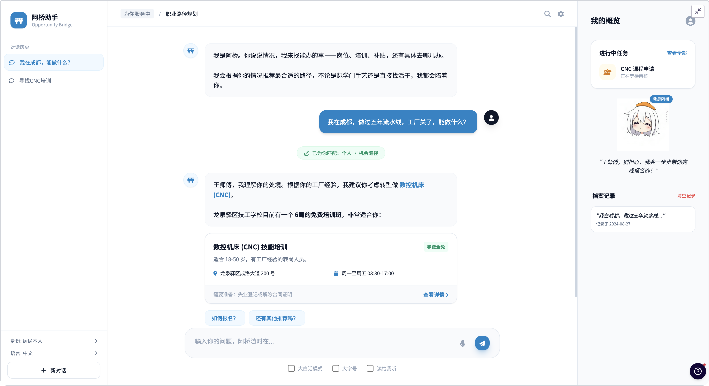

# 阿桥 · Opportunity Bridge Agent

[English](README.md)



*这是照着做的 UX Pilot 设计稿，不是运行中程序的截图。稿子里有两处没法照搬：它引的
CDN，以及吉祥物那句「王师傅，别担心……」——那正是人设明令禁止、`no_false_reassurance`
会拦下的空头安慰。[改了什么、为什么](docs/14-interface.md)。*

**阿桥**是一个对话式 Agent，把 **「我不知道自己能做什么、去哪里办、是否符合条件」** 变成一条
可执行的路径：**诊断 → 推荐 → 办理 → 跟进 → 人工兜底**。

它不是「大模型 + 提示词」，而是按系统来搭的：
**模型 + 指令 + 上下文 + 工具 + Agent 循环 + 状态 + 护栏 + 评测 + 可观测性**。
每一项在代码树里都有落点，也都有测试守着 ——
[docs/README.md](docs/README.md) 把每个建设步骤对应到具体文件。

```bash
make demo          # 离线跑，不需要 API Key：http://localhost:8787
make env           # 从 .env.example 生成 .env，然后填 Key
make run           # 接 Claude API
make run-deepseek  # 接 DeepSeek
make check         # gofmt、vet、全部测试，含评测套件
```

**默认用中文回答**——`OBA_REPLY_LANGUAGE` 可取 `zh-CN`（默认）、`en`、`match`；
顶栏的语言选择会改变**下一条回答**，而不是下一次会话。

---

## 它到底解决什么问题

宏观表述——人民日益增长的美好生活需要与不平衡不充分的发展之间的矛盾——描述的是一个
国家，不是一份需求规格，软件够不着。它里面能被软件够着的那一层是：

> 普通人获得稳定收入、上升机会和公共保障的能力，被距离、语言、材料手续，以及
> 「根本不知道有这回事」，同这些资源实际所在的位置隔开了。

这道缝隙由**信息不对称**和**事务性摩擦**组成，两者都可做。它做不了下面那层
「东西本身不够」——这一点它会明说，见[最重要的那条边界](#最重要的那条边界)。

## 四类受众，四个意图

需求里的每一条，都成为 [`internal/intent/intent.go`](internal/intent/intent.go)
里的一个**一等公民意图**：各自带着目标、验收标准、边界、工作流、必要信息槽、
工具白名单、校验器和预算。路由、权限、提示词拼装、界面上的意图卡片、评测套件和
文档，读的都是这同一张登记表。

| 意图 | 服务谁 | 做什么 |
|---|---|---|
| **`individual_pathway`**（为个人） | 一个人 | 梳理技能、经历、城市与约束；匹配真实岗位、培训、创业支持与补贴；把公布的条件逐条读成「已满足 / 未满足 / 不确定」；代拟材料；跟进办理；解释流程 |
| **`low_access_support`**（为高摩擦人群） | 毕业生、转岗工人、灵活就业者、农民工、照护家庭 | 先解决摩擦再谈内容——大白话、大字号、读给你听、贴近口语的方言语域、窗口协助模式；每次都给电话或带开放时间的现场地址；尽早转人工，并把上下文先写好，不用本人再讲一遍 |
| **`service_orchestration`**（为服务机构） | 窗口与社区工作人员 | 把就业、培训、社保、医保、托育、养老、住房等分散流程，串成一个人的一张可追踪任务清单，每条都有责任人、办理渠道和明确的前后依赖——让居民不再充当各窗口之间的「集成层」 |
| **`supply_demand_insight`**（为社会） | 规划与政策 | 只在已授权、去标识的聚合数据上，识别「岗位在这里但人够不着」和「补贴在这里但没人会领」；带 k-匿名下限，每个数字旁边写明授权覆盖率，只讲相关不讲因果 |

## 最重要的那条边界

**它不认定资格，也不给人打分。**

这不是免责声明，而是「缓解不平衡」和「把不平衡自动化」的分界线。一个悄悄给人排序、
再用这个排序决定给谁看什么的 Agent，等于把它本要绕开的那道门槛重建了一遍，而且比
它取代的那个窗口更难问责——因为没人看得见推理过程。

所以规则写在代码里，不是写在文案里：

| 规则 | 由谁强制 |
|---|---|
| 不给资格结论 | `criteria_explain` 结构上就返回不了结论；`no_eligibility_verdict` 拦下声称结论的回答 |
| 人群标签只加不减 | `no_cohort_downranking` **阻断**；检索加权全是加分项，且每一项都写明理由 |
| 不许编造项目 | `no_invented_identifiers` 拿回答里的每个编号去比对语料库，对不上就**阻断** |
| 不可逆动作必须过人 | 审批与「这一次调用的参数哈希」绑定 |
| 没有授权就不碰个人数据 | 四种授权范围，在任何工具函数体执行**之前**校验 |
| 聚合结果里不出现可识别信息 | k-匿名下限 + `no_identifiers` **阻断** |
| 回答必须是对方读得懂的语言 | `reply_language` 校验的是**交付出去的文字本身**，不是那句提示词 |

## 阿桥是谁

桥，是这个产品自己的比喻；名字前面加「阿」，是称呼熟人而不是称呼公家人的说法。
这个前缀就是设计决定本身：这套系统对任何人都不掌握裁量权——它不认定资格、不给人
打分，只说明该由谁来定。叫「顾问」「助手」会替它主张一个它并不具备的身份，而它面
对的人群里，很多人对「听起来很正式的东西」的经验，恰恰是办不下来的手续。

语气也由此而来。平静、简短、从不安慰——不说「别担心」，不说「放心」。不知道就直说
一次，不为此道歉。把对方当成有能力的人，讲真正的规则，而不是简化过的版本。

而且，正因为「温和」恰恰最容易把一句诚实的「不行」磨掉，人设不是靠嘱咐生效的，而是
配了一道校验：`no_false_reassurance` 会拦下「没有事实支撑的安慰」，修复方向永远是同
一个形状——**什么是确定的、什么是不确定的、由谁来定。**

头像是一座「读起来像一张脸」的桥：桥面之上是两盏灯笼一样的眼睛，桥面之下的拱券就是
嘴。四种情绪，其中真正有用的是 **`serious`**：当这一轮被护栏拦下或被拒绝时，拱券会
拉平——因为界面一边说「我把这条答案拦下来了」一边还在笑，等于用像素做了人设明文禁
止的事。

详见 [docs/13-name-and-voice.md](docs/13-name-and-voice.md)。

## 界面上能看见什么

三栏：左边是会话，中间是对话，右边是**我的概览**——进行中任务、阿桥、「关于我你都
存了什么」，以及四项授权，每一项旁边都有「授权 / 撤回」。

对话里：

- 本轮路由到哪个意图，做成一枚居中的标记（`已为你匹配：个人 · 机会路径`），后面写着
  是怎么定的
- **机会卡片**，全部字段来自工具返回——标题和编号、金额或绿色的「学费全免」、简介、
  地点 / 时间 / 电话、需要准备的材料，以及「查看详情」展开公布的条件和出处
- 审批卡片：把**将要提交的原文**完整摆出来——在此之前什么都没做
- 授权卡片：用大白话写清楚存什么、干什么用、存多久
- 顺着刚才发生的事给出的追问建议
- `› 系统运行详情 · N 步`——每一次工具调用、每一条护栏发现、整段执行轨迹，默认收起，
  顶栏有一个总开关

凡是**改变了这条答案的东西，就写在答案里**，而且是用对方的语言：被拦下的一轮会说清
是哪条规矩拦的、什么都没做。其余的都折起来。排查问题的人和读答案的人看的仍然是同一
份记录，只是它不再挡路。

界面按 UX Pilot 设计稿实现；[docs/14-interface.md](docs/14-interface.md) 记录了哪些
照做、哪些必须改（不引 CDN，以及有一句文案是人设明令禁止的）、以及为什么。

## 上手

```bash
git clone https://github.com/damonleelcx/Opportunity-Bridge-Agent
cd Opportunity-Bridge-Agent
make demo                 # 回放一段固定对话；无需 API Key，无需联网
```

配好凭据。可以写在 `.env` 里：

```bash
make env          # 复制 .env.example，权限设为 600
# 编辑 .env：OBA_BACKEND=deepseek，DEEPSEEK_API_KEY=sk-...
make run-deepseek
```

也可以直接用环境变量——环境变量永远优先于文件：

```bash
ANTHROPIC_API_KEY=sk-ant-...  make run           # Claude
DEEPSEEK_API_KEY=sk-...       make run-deepseek  # DeepSeek
```

两个供应商驱动的是同一个 Agent——路由、工具、护栏、校验器、预算和审批闸门，都不知道
这一轮是谁回答的。模型 ID 跟随 `OBA_BACKEND` 自动切换；如果模型 ID 属于另一个供应商，
启动时直接拒绝，而不是被悄悄映射成对方的默认模型。映射关系，以及两处「不报错但会静
默变差」的报文差异，见 [docs/12-deepseek.md](docs/12-deepseek.md)。

进去之后值得试的四件事：

1. 用「居民本人」身份问：*我在成都，做过五年流水线，工厂关了，能做什么？*
   看路由徽标、看它检索、看条件被逐条读成「已满足 / 未满足 / 不确定」。
2. 勾上 **大白话**。这不是前端改写，它走的是 Agent 自己用的那条
   `accessibility_set` 路径。
3. 让它帮你提交申请。在你确认原文之前，什么都不会发生。
4. 身份切到 **规划/政策分析**，问哪个区「岗位在但人够不着」。注意被压制的小样本
   分组，和旁边写着的授权覆盖率。

## 架构

```
web/static ── 对话界面（SSE，无构建步骤，编译进二进制）
     │
internal/httpapi ── 只做传输，本身不含业务逻辑
     │
internal/agent ─── 循环：理解 → 计划 → 执行 → 校验 → 回应
     ├── internal/intent ──── 登记表：四类受众的完整定义
     ├── internal/prompt ──── 三层：宪章 | 意图 | 上下文（两个缓存断点）
     ├── internal/llm ─────── 模型边界（Anthropic · DeepSeek · 测试用脚本回放）
     ├── internal/tools ───── 14 个工具；参数校验、权限、授权、审批
     ├── internal/retrieval ─ BM25 + 硬性元数据过滤，可解释
     ├── internal/guardrail ─ 入口护栏 + 各意图声明的校验器
     ├── internal/store ───── 任务态 | 会话历史 | 长期记忆，三者分开
     └── internal/obs ─────── 每个决策一条事件，实时推给界面
```

| 路径 | |
|---|---|
| `cmd/obagent` | 服务端 |
| `cmd/obaeval` | 评测执行器 |
| `data/` | **样例**语料——所有编号以 `SAMPLE/` 开头 |
| `evals/` | 27 个用例：正常、边界、对抗、路由 |
| `demo/` | 离线回放脚本 |
| `.env.example` | 全部变量及说明；`.env` 本身已 gitignore |
| `web/static/avatar.js` | 阿桥的头像——内联 SVG，四种情绪 |
| `docs/` | 每个建设步骤一页，索引见 [docs/README.md](docs/README.md) |

## 运行环境

Go 1.25+（postgres 驱动要求）。单个二进制，界面已内嵌。Linux / macOS / Windows。

状态有两种后端，同一时间只用其中一种。设置 `OBA_DATABASE_URL` 就是 postgres，
正式部署用这个；配了却连不上时进程直接拒绝启动，而不是悄悄写到别处——否则运维
以为数据在库里，而事实并非如此。不设置就是 `OBA_STATE_PATH` 指向的 JSON 快照，
本地开发用这个；两个都不设也能跑，只是不记事。两种后端的读路径都走内存，所以
请求链路不依赖你选了哪一种。

除模型 API 外，postgres 是唯一的外部服务，且仅在你主动启用时才需要。

## 错误码

每个失败都带错误码、对当事人意味着什么、以及下一步能做什么。

| 错误码 | 含义 |
|---|---|
| `CONSENT_REQUIRED` | 缺一项授权；连「该怎么问」一并返回 |
| `APPROVAL_REQUIRED` | 什么都没做，必须先由人确认 |
| `TOOL_NOT_PERMITTED_FOR_INTENT` / `_FOR_ROLE` | 该动作超出这类受众的边界 |
| `ARGUMENT_INVALID` | 逐个点名有问题的字段，以及怎么改才对 |
| `EVIDENCE_REQUIRED` | 仅凭口头汇报不能把任务标记为完成 |
| `OPPORTUNITY_NOT_FOUND` | 编号不在语料库里——先检索，不要猜 |
| `MODEL_AUTH_FAILED` / `MODEL_RATE_LIMITED` / `MODEL_UNAVAILABLE` | 均附修复办法 |
| `MODEL_BILLING` | DeepSeek 余额不足——这是永久性失败，不会重试 |
| `SCRIPT_EXHAUSTED` | 脚本后端拒绝即兴发挥 |
| `LOCALE_INVALID` | 不支持的回答语言 |
| `ENV_FILE_INVALID` | `.env` 里某一行有问题，会指出行号 |

## 老实说明的边界

- **语料是虚构的。** 21 条岗位/培训/扶持/补贴记录，12 篇办事指南，形态照着真实的
  做，好让整条链路能端到端跑通。编号以 `SAMPLE/` 开头，而且这个前缀会一直显示到
  用户屏幕上——一个说不清自己数据是假的演示，早晚会被人当真。
- **`application_submit` 没有接真实受理系统。** 它把这次提交记录下来并纳入跟踪，
  同时明说本人仍需通过所示渠道完成办理。假装「已提交」比说「做不到」更糟。
- **语音用浏览器自带能力。** 音频不离开设备；浏览器不支持时会直说，并给出线下路径。
- **方言支持的是语域，不是方言本身。** 它会明说，而不是假装会讲。
- **样例语料是英文写的**，所以中文回答里的项目名称和地址会原样引用英文。这是刻意的
  ——把地址「翻译」一遍等于把地址编出来——换成真实的中文数据源之后这个问题就没有了。

## 许可证

Apache 2.0。
